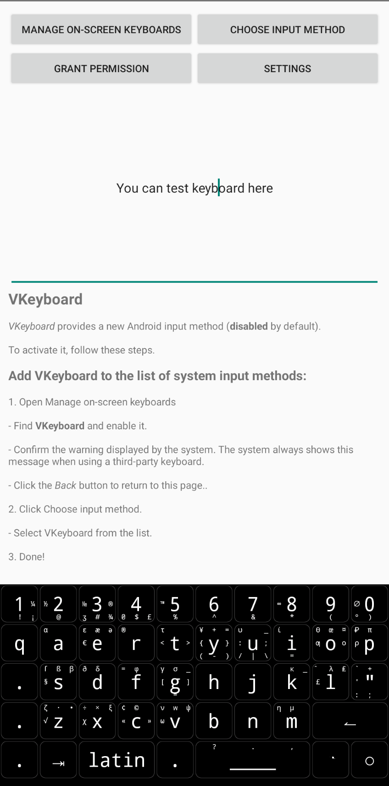

# VKeyboard
Customizable virtual keyboard for Android 

## Installation
1. Download & install latest APK from [Releases](https://github.com/vladgba/VKeyboard/releases) page or clone repo & compile sources
2. Copy "vkeyb" folder from this repository to storage (very often "/sdcard", "/storage/emulated/0" or "Internal Storage")
3. Edit layouts to your liking
4. Open the VKeyboard application and press the buttons for quick access to settings necessary for the keyboard to work
5. Set sizes in app settings to your liking

## JSON layouts

 - `"key": "G"`  - label of key
 - `"code": "-67"`  - keycode (if negative - KeyEvent.KEYCODE)
 - `"cur": "1"`  - allow cursor to move when moving the pointer
 - `"ext": "qTpLRdBb"`  - extended chars what can be accessed by sliding
 - `"text": "hello world!"`  - text, what be entered after button is clicked
 - `"repeat": "1"`  - can key repeat when sliding left and right
 - `"forward": "112"`  - right slide keycode
 - `"size": "2"` - width of key

