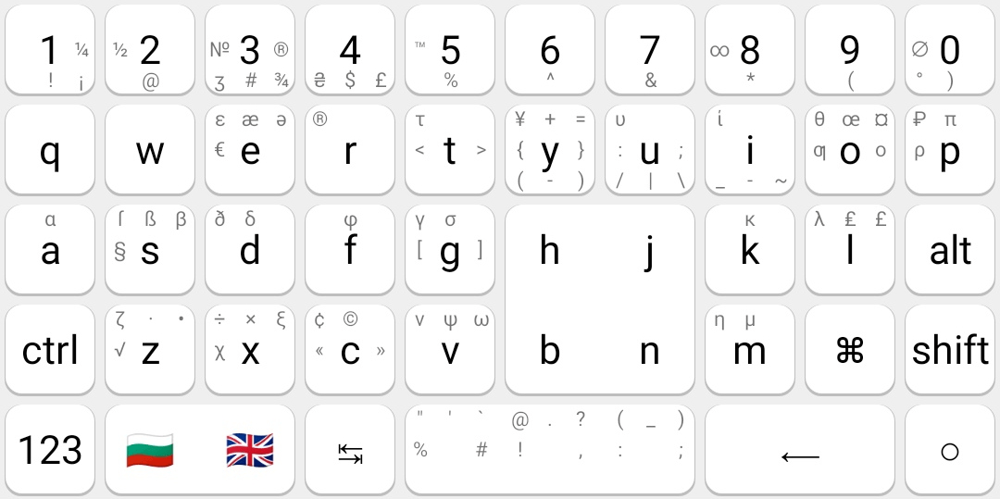

# VKeyboard
Customizable virtual keyboard for Android 

## Installation
1. Download & install latest APK from [Releases](https://github.com/vladgba/VKeyboard/releases) page or [PlayStore](https://play.google.com/store/apps/details?id=com.vladgba.keyb)
3. Select layouts that you need and click back button
4. Enable keyboard using quick access buttons
5. Customize keyboard if needed

